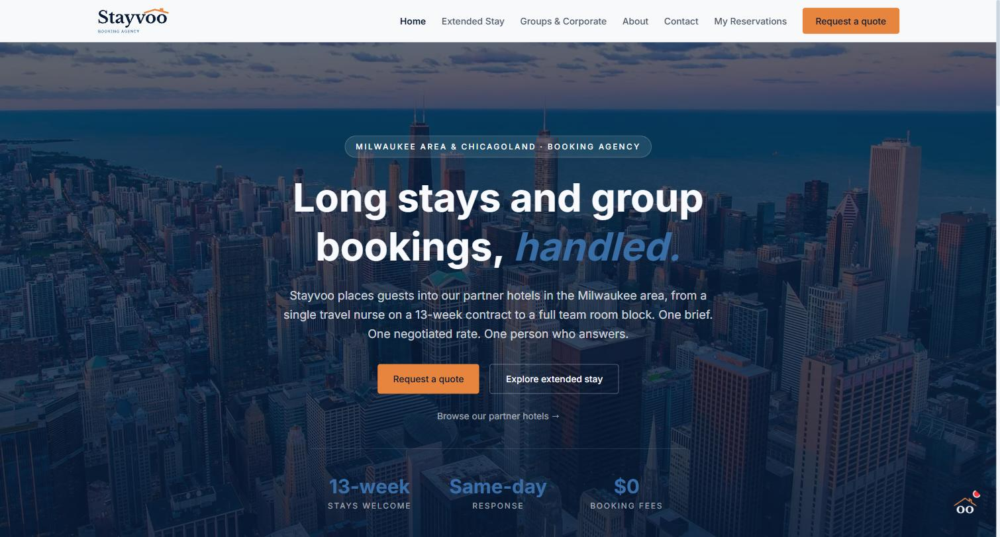
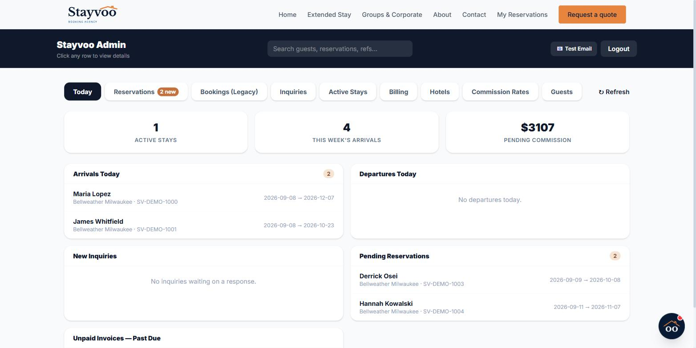
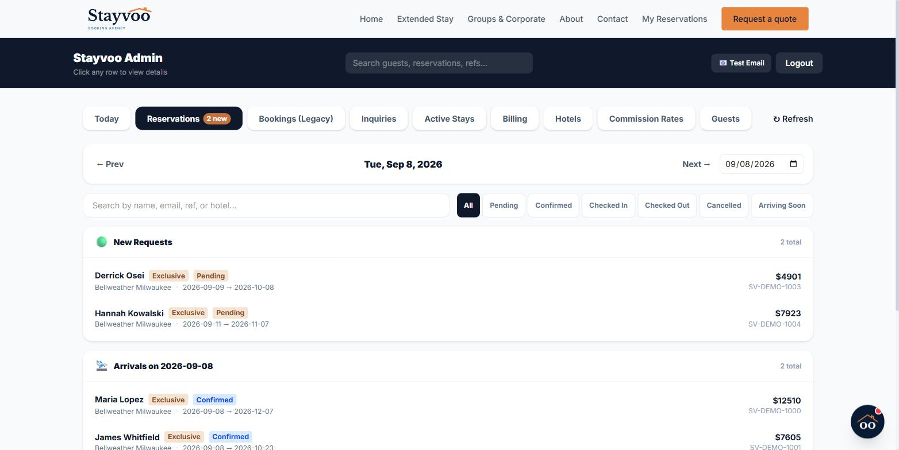
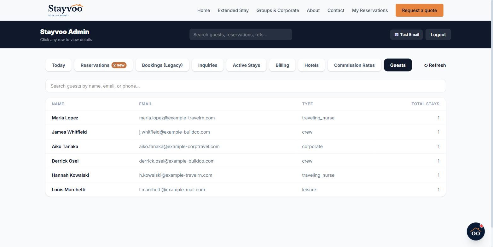
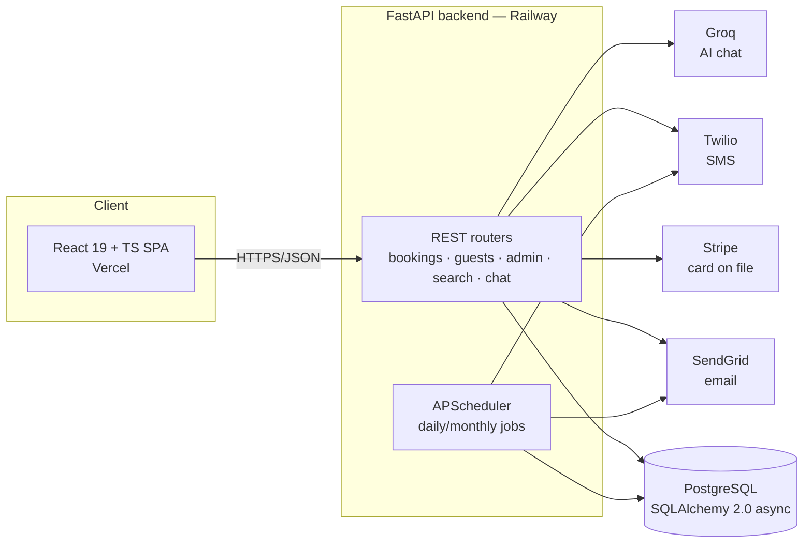

# Stayvoo

Extended-stay and group hotel booking platform — a booking engine, guest self-service portal, and admin operations console built on a FastAPI/React SaaS stack, live in production at [stayvoo.com](https://stayvoo.com).

## Screenshots


*The public-facing site, live at stayvoo.com.*


*Core workflow: today's arrivals, departures, pending reservations, and outstanding commission at a glance. Shown with representative demo data seeded locally, not real guest bookings.*


*Global search and filtering across every reservation status, grouped by date and request type.*


*Guest records with stay history, searchable by name, email, or phone.*

## Problem

Independent hotels that handle extended-stay guests (travel nurses, construction crews, corporate teams) and group bookings rely on phone calls, spreadsheets, and generic OTA listings. There's no lightweight system for: taking a booking with a card on file, giving guests a way to check their reservation and message the property without an account/password, and giving the operator a single dashboard to confirm bookings, track commissions, and bill hotels — without paying for full hotel-PMS software.

## Solution

Stayvoo is a two-sided booking platform:

- **Guest-facing site** — search/browse partner hotels, book with a card on file (Stripe), get a passwordless "magic link" portal to view reservations and message the property, get an AI chat assistant for extended-stay/group inquiries.
- **Admin console** — confirm/cancel bookings and reservations, track guest stays and checkout status, log commission owed per hotel, send monthly invoice emails with delivery tracking, global search, and a full audit trail of every change.

It's a single operator's real, revenue-generating product — not a demo app — which is also why the security and operational hardening described below was necessary rather than aspirational.

## Features

- Hotel/room search and browse with date + party-size filtering
- Card-on-file booking flow (Stripe SetupIntent, no charge at booking — payment is collected at the hotel)
- Passwordless guest portal via emailed magic links (`/my-stay/{token}`), with reservation history and two-way messaging
- AI booking assistant (Groq-hosted Llama 3.3) that qualifies extended-stay/group leads and hands off to a human
- Admin console: booking/reservation lifecycle management, a "Today" operations view (arrivals, departures, pending confirmations, past-due invoices), global search across guests/bookings/reservations, per-field audit log
- Automated guest lifecycle emails/SMS (booking received, confirmed, pre-arrival reminder, post-stay, stay-expiry reminder) run on a daily job scheduler
- Monthly hotel commission invoicing with SendGrid delivery-event tracking (delivered/opened/bounced)
- Guest data protected by ownership checks on every guest-portal route (see Security)

## Architecture



The frontend and backend are independently deployed and communicate over a CORS-restricted REST API — there's no server-rendered coupling between them.

## Technology Stack

**Backend**
- FastAPI on Python, ASGI via Uvicorn
- SQLAlchemy 2.0 (async ORM) + asyncpg driver, PostgreSQL
- Pydantic 2 for request/response validation
- APScheduler for cron-style background jobs (pre-arrival reminders, post-stay follow-ups, monthly invoicing)
- Stripe, Twilio, SendGrid, Groq SDKs for external integrations

**Frontend**
- React 19 + TypeScript, built with Vite 8
- Tailwind CSS v4
- React Router 7
- Stripe.js / `@stripe/react-stripe-js` for the payment-method collection UI
- Server-side prerendering step (`scripts/prerender.tsx`) run at build time for key marketing routes

**Database**
- PostgreSQL, schema managed by SQLAlchemy's `create_all` plus a small set of idempotent `ALTER TABLE ... ADD COLUMN IF NOT EXISTS` statements run at startup (see Design Decisions — no Alembic)

**Auth**
- Admin: a single shared password compared with `secrets.compare_digest` (timing-safe), passed via an `X-Admin-Password` header, required on every admin route
- Guests: passwordless — a random 32-byte URL-safe token (`secrets.token_urlsafe(32)`, 30-day sliding expiry) emailed as a magic link, not a password or session cookie
- Note: `PyJWT` is present in `requirements.txt` but is not currently used by any route in this codebase — auth is header/token-based, not JWT-based

## Security

Stayvoo went through a real hardening pass, not a checklist exercise — the fixes below came out of an internal audit of the live product and are each backed by a regression test in `tests/test_e2e.py`.

| Issue | Fix | Where |
|---|---|---|
| **IDOR** — a guest's access token could be used to read/post into *another* guest's reservation message thread by guessing/obtaining a UUID | Every guest-portal route resolving a booking/stay/inquiry/reservation now calls `_verify_owns_record()`, which checks the record's `guest_id` (falling back to a denormalized email match for pre-existing rows) before returning anything; a non-owned record 404s instead of leaking existence | `backend/routers/guests.py` |
| **Weak/hardcoded admin auth** | Removed a hardcoded fallback password. `backend/services/admin_auth.py` now reads `ADMIN_PASSWORD` from the environment and raises at import time (app refuses to start) if it isn't set — no default, no silent fallback. Comparison uses `secrets.compare_digest` to avoid timing side-channels | `backend/services/admin_auth.py` |
| **Unbounded outbound communications** | An allowlist gate sits in front of every email/SMS send. `ALLOWLIST_EMAILS`/`ALLOWLIST_PHONES` are read from the environment at import time; if unset, the allowlist is empty and **everything is blocked** (fails closed, not open) rather than defaulting to "send to anyone" | `backend/services/allowlist.py` |
| **No audit trail on admin changes** | `record_change()` writes one `AuditLog` row per changed field (old value, new value, who, when) whenever an admin edits a booking/reservation/stay, skipping unchanged fields | `backend/services/audit.py` |
| **Open/wildcard CORS** | The API sets an explicit origin allowlist (`localhost:5173`, `stayvoo.com`, `www.stayvoo.com`, plus a regex for `*.vercel.app` preview deploys and an optional `FRONTEND_URL` env override) — no `allow_origins=["*"]` | `backend/main.py` |
| **Guest/email enumeration** | `POST /guests/login` always returns `{"sent": true}` whether or not the email is registered, so the endpoint can't be used to confirm which emails have accounts | `backend/routers/guests.py` |
| **No abuse protection on public write endpoints** | An in-memory sliding-window rate limiter guards booking creation and guest login (e.g. 10 bookings / 10 min per IP, 5 login requests / 10 min per IP) | `backend/services/rate_limit.py` |

**What's guarding against regression:** `tests/test_e2e.py` is a 22-test Playwright + pytest suite that runs against the live production site (not a local or staging copy) and includes, among others: `test_guest_cannot_read_or_post_into_another_guests_reservation_thread` (the IDOR fix above), `test_admin_routes_require_auth`, `test_expired_magic_link_rejected` / `test_invalid_magic_link_token_rejected`, `test_xss_payload_stored_as_inert_text` (proves stored user input round-trips as inert data, not executed — React's default escaping plus a repo-wide check that `dangerouslySetInnerHTML` isn't used), `test_invoice_send_blocks_non_allowlisted_recipient` / `test_invoice_send_rejects_missing_email`, and `test_edge_case_reservation_get_requires_correct_token`.

**Honest limits:** this is one e2e suite, not a penetration test, and it is not wired into CI (there is no CI in this repo — see Future Improvements) — it currently runs manually against production. There's no dependency-vulnerability scanning, no WAF, and the rate limiter is in-memory (see below), so it's a single layer of defense, not a security program. Treat this section as "here's what was found and fixed, with tests that would catch a regression," not a claim of a completed audit.

## Testing

- `tests/test_e2e.py` — 22 test functions, Playwright (browser-driven flows) + `requests` (API-level checks) + pytest, run with `pytest tests/test_e2e.py -v`
- Runs **against live production** (`https://stayvoo.com` / the Railway API), by design — there's no seeded staging environment, so tests use real endpoints with a dedicated allowlisted test email/phone and Stripe's test card (`4242 4242 4242 4242`)
- Coverage includes: full booking flow, returning-guest autofill, admin confirm flow, guest↔admin messaging round-trip, cancellation, admin login/logout and auth-required checks, checkout-before-checkin and missing-field validation, reservation status lifecycle, inquiry-to-stay conversion, global search, the "Today" admin view shape, invoice-send guardrails, double-submit protection on the booking form, the IDOR fix, expired/invalid magic links, and XSS-payload storage
- No unit test suite exists — see Future Improvements

## Deployment

- **Backend** — Railway, via `backend/railway.toml` (Nixpacks build) and `backend/Procfile`; `uvicorn main:app --host 0.0.0.0 --port $PORT`, health-checked at `/health`
- **Frontend** — Vercel, via the root `vercel.json` (`cd frontend && npm run build`, output `frontend/dist`), with per-page rewrites for a few static marketing routes and an SPA fallback for the rest
- The product's live site is [stayvoo.com](https://stayvoo.com); this repository doesn't include a separate demo/staging deployment

## Environment Setup

Backend configuration is entirely environment-variable driven — see `backend/.env.example` for the full list, reproduced here with purpose:

| Variable | Purpose |
|---|---|
| `DATABASE_URL` | PostgreSQL connection string (auto-normalized to the `asyncpg` driver) |
| `SECRET_KEY` | Present in `.env.example`; not currently read by any application code |
| `ADMIN_PASSWORD` | Required — admin console auth; app refuses to start without it |
| `GROQ_API_KEY` | AI chat assistant; without it, chat falls back to a static "call us" response |
| `CLOUDINARY_CLOUD_NAME` / `CLOUDINARY_API_KEY` / `CLOUDINARY_API_SECRET` | Media hosting |
| `TWILIO_ACCOUNT_SID` / `TWILIO_AUTH_TOKEN` / `TWILIO_PHONE_NUMBER` | SMS notifications |
| `SENDGRID_API_KEY` | Transactional email |
| `STRIPE_SECRET_KEY` / `STRIPE_WEBHOOK_SECRET` | Payment-method capture and webhook verification |
| `ALLOWLIST_EMAILS` / `ALLOWLIST_PHONES` | Comma-separated recipients allowed to receive outbound email/SMS; unset = nothing goes out (fail closed) |

Copy `backend/.env.example` to `backend/.env` and fill in real values for local development.

## Local Development

```bash
# Backend
cd backend
python -m venv venv
venv\Scripts\activate          # Windows; use `source venv/bin/activate` on macOS/Linux
pip install -r requirements.txt
cp .env.example .env           # fill in DATABASE_URL and ADMIN_PASSWORD at minimum
uvicorn main:app --reload

# Frontend
cd frontend
npm install
npm run dev
```

The backend creates tables and runs its startup migrations automatically against whatever `DATABASE_URL` points to (see Design Decisions) — no separate migration command is needed.

## Engineering Challenges

- **Schema evolution without a migration framework.** There's no Alembic. `backend/main.py`'s `_run_column_migrations()` runs a fixed list of idempotent `ALTER TABLE ... ADD COLUMN IF NOT EXISTS` statements at every startup, alongside `Base.metadata.create_all` for net-new tables. This is a deliberate tradeoff for a solo-maintained project on a single environment (no branching schema states to reconcile) — it would not scale to a team or to multiple environments needing coordinated, reversible migrations, and that's an honest limitation, not an oversight.
- **Rate limiting without Redis.** `backend/services/rate_limit.py` is an in-process sliding-window limiter (a dict of timestamps, no external store), explicitly documented in the module as a single-instance-only tradeoff: it resets on every redeploy and won't coordinate limits across multiple backend instances. Correct for a single-instance Railway deployment on a zero infrastructure budget; would need to move to Redis (or similar) before horizontally scaling the backend.
- **Deploy plumbing on Vercel.** Commit history shows several rounds of fixing the frontend build on Vercel: vite/typescript/tailwind had to be moved into `dependencies` (Vercel's production install skips `devDependencies` by default), and `vercel.json` had to be relocated to the repo root because Vercel wasn't reading it from `frontend/`. Left in git history rather than squashed, since it's a realistic record of the kind of platform-specific debugging that comes with shipping to a new host.
- **A real IDOR found and fixed post-launch.** The guest-portal reservation-messaging endpoints originally trusted a caller-supplied `reservation_id`/`booking_id`/`stay_id` with no ownership check against the caller's guest token — any valid guest token could read or post into *any* other guest's message thread by obtaining the record's UUID. Fixed by adding `_verify_owns_record()` ownership checks to every guest-portal route, with a permanent regression test (`test_guest_cannot_read_or_post_into_another_guests_reservation_thread`).
- **Removing hardcoded secrets found in an internal audit.** The admin auth path previously had a hardcoded fallback password and the outbound-comms allowlist previously hardcoded real PII (an actual test email/phone) rather than reading it from configuration. Both were moved to required environment variables that fail closed/fail fast if unset, closing a hole where a misconfigured deployment could silently run with a known password or leak real guest data to a hardcoded test contact.

## Design Decisions

- **Two deploy targets, one repo.** Frontend (Vercel) and backend (Railway) are deployed independently from the same monorepo rather than split into two repos — simpler for a solo developer to keep in sync, at the cost of a slightly unusual root `vercel.json` that has to `cd frontend` explicitly.
- **Magic links over passwords for guests.** Guests never set a password; a booking automatically provisions a 30-day, sliding-expiry access token emailed as a link. This removes password-reset flows and credential-stuffing risk for the guest-facing surface entirely, at the cost of guests needing email access to reach their portal.
- **No charge at booking.** Stripe is used to capture a card on file (`SetupIntent`) at booking time, not to charge immediately — actual payment happens at the hotel. This matches how the underlying hotels operate and avoids Stayvoo holding guest funds.
- **Snapshotting reservation data.** The `Reservation` model stores denormalized snapshots of hotel/guest details (`hotel_name_snapshot`, `guest_email`, etc.) rather than only foreign keys, so historical reservations remain accurate and readable even if the underlying hotel or guest record later changes.
- **Fail-closed outbound comms.** Rather than defaulting to "send to real guests," the allowlist defaults to sending nothing until explicitly configured — a conservative choice appropriate for a system still being hardened.

## Future Improvements

Known gaps, not oversights discovered by someone else — listed here deliberately rather than left implicit:

- **No CI/CD.** There is no `.github/workflows` in this repo. The existing e2e suite runs against live production, so wiring it into automatic CI needs a deliberate decision first (e.g., a staging environment, or scoping which tests are safe to run unattended) rather than being bolted on.
- **No unit tests.** Only the end-to-end suite exists; there's no fast, isolated unit-test layer for business logic (commission calculation, token expiry, allowlist parsing, etc.).
- **No Docker.** Local setup is a manual virtualenv + `npm install`; there's no containerized dev or deploy path.
- **TypeScript not in strict mode.** `frontend/tsconfig.app.json` does not set `"strict": true` — type-checking is looser than it could be.
- **Distributed rate limiting** — see Engineering Challenges; would matter if the backend moved off a single instance.
- **Alembic-managed migrations** — see Engineering Challenges; the current ad-hoc `ALTER TABLE` approach would need replacing before this could safely support multiple environments or a team.

## Freelance Relevance

This project is a working demonstration of the systems most small-business and hospitality clients actually ask for:

- **Booking/reservation systems** — a real availability-aware booking flow with date validation, room inventory decrement, and a multi-stage reservation lifecycle (pending → confirmed → checked in → checked out / cancelled)
- **Payment integration** — Stripe card-on-file capture without full checkout complexity, matching businesses that bill at time of service rather than online
- **Guest-data security** — IDOR prevention, timing-safe auth, fail-closed outbound messaging, and audit logging are exactly the concerns that come up whenever client data (names, emails, phone numbers, payment methods) is stored and shown back to the people it belongs to
- **SaaS operations tooling** — an admin console built around what an actual operator needs day to day (a "Today" view, commission tracking, invoice delivery status) rather than generic CRUD screens
- **Multi-vendor integration** — Stripe, Twilio, SendGrid, and Groq wired together in one backend, including handling their webhooks and failure modes (e.g., what happens when Twilio/SendGrid aren't configured, or a webhook signature fails)
